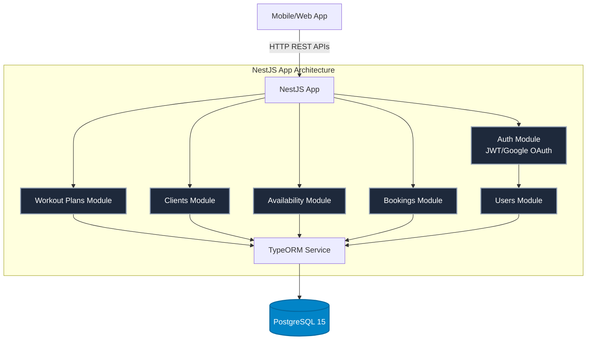
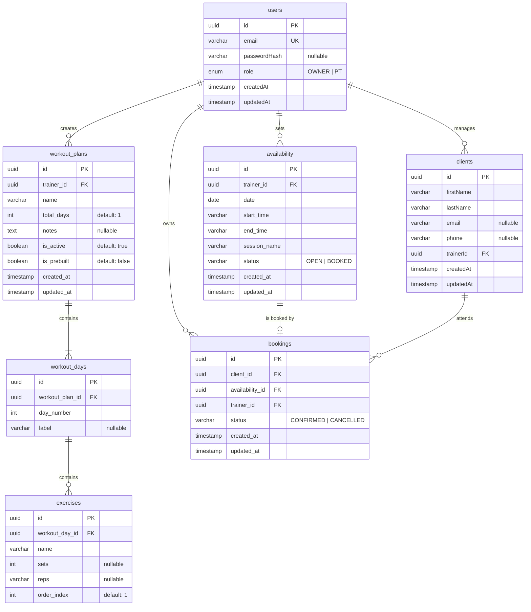
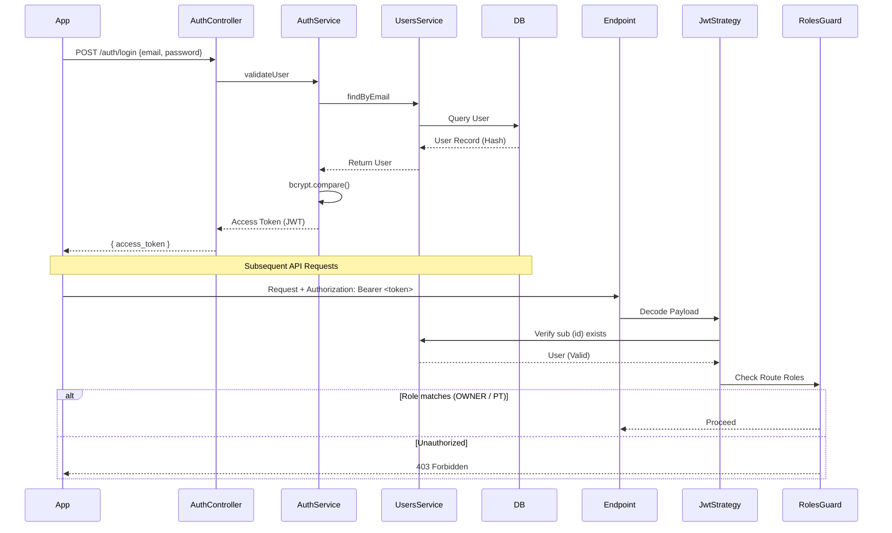
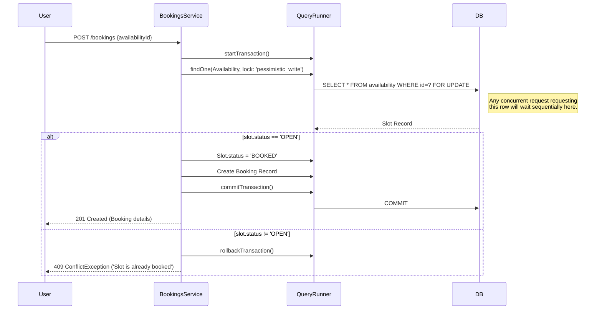

# WellVantage Gym Management System - Backend API

<p align="center">
  
  
  
  
  
</p>

A robust, scalable backend for the WellVantage mobile application, built with **NestJS** and **PostgreSQL**. The platform handles trainer availability management, client onboarding, workout plan generation (including nested exercises), and secure scheduling mechanisms.

---

## 📑 Table of Contents

1. [Architecture & Diagrams](#-architecture--diagrams)
   - [System Architecture](#system-architecture)
   - [Database Entity Relationship Diagram (ERD)](#database-erd)
   - [Authentication & RBAC Flow](#authentication--rbac)
   - [Repeat Availability Generation Flow](#repeat-availability-flow)
   - [Booking & Double-Booking Prevention](#double-booking-prevention)
2. [API Reference & Endpoints](#-api-reference)
3. [Business Logic Details](#-business-rules--logic)
4. [Environment Setup](#-environment-variables)
5. [Quick Start & Scripts](#-quick-start)
6. [Known Limitations](#-known-limitations)

---

## 🏗 Architecture & Diagrams

### System Architecture

The project follows a standard NestJS modular architecture, dividing responsibilities into distinct domain modules while keeping cross-cutting concerns (Auth, DB) accessible globally.



### Database ERD

*This ERD reflects the literal columns, constraints, and relationships implemented in the TypeORM entities.*



### Authentication & RBAC

The system relies primarily on JWT Bearer strategies with a fallback for Google OAuth. Requests are validated via `JwtAuthGuard`, followed by `RolesGuard` determining PT vs. OWNER-level routes.



### Repeat Availability Flow

When submitting multi-date availability templates from the client.

```mermaid
flowchart TD
    Req[POST /availability] --> Parse[Extract CreateAvailabilityDto]
    Parse --> IsRepeat{isRepeat == true and <br> repeatDates has length?}
    
    IsRepeat -- Yes --> BuildArray(Array = [date, ...repeatDates])
    IsRepeat -- No --> BuildSingle(Array = [date])
    
    BuildArray --> Loop[Loop Dates]
    BuildSingle --> Loop
    
    Loop --> Check[Check DB for clash:<br>same trainerId + date + startTime]
    
    Check -- Clash Found --> Throw409[Throw 409 ConflictException]
    Check -- Clear --> Push[Push slot obj to createdSlots]
    
    Push --> NextDate{More dates?}
    NextDate -- Yes --> Loop
    NextDate -- No --> SaveDB[TypeORM repo.save(createdSlots)]
    SaveDB --> Res[Return 201]
```

### Double Booking Prevention

The application relies heavily on explicit Postgres pessimistic write locks applied during an ACID transaction to prevent concurrency bugs when booking.



---

## 🧭 API Reference

### Auth Context (`/api/auth`)
| Method | Endpoint | Use Case | Auth Required | Body format |
| :--- | :--- | :--- | :--- | :--- |
| `POST` | `/register` | Sign up standard user | No | `RegisterDto` { email, password, role? } |
| `POST` | `/login` | Get JWT token | No | `LoginDto` { email, password } |
| `GET` | `/google` | Trigger OAuth | No | - |
| `GET` | `/google/callback` | OAuth callback target | No | - |

### Workout Plans Context (`/api/workout-plans`)
| Method | Endpoint | Use Case | Body format |
| :--- | :--- | :--- | :--- |
| `POST` | `/` | Create a tailored or custom plan, supporting multiple days and nested exercises. | `CreateWorkoutPlanDto` |
| `GET` | `/` | Returns user's plans. (If OWNER: all active plans. If PT: own active plans + Global prebuilt plans). | - |
| `GET` | `/:id` | Returns populated plan including nested `days` and `exercises`. | - |
| `DELETE` | `/:id` | Irrevocably destroys a plan. Owners can delete globally. | - |

*(Typical `CreateWorkoutPlanDto` example)*
```json
{
  "name": "Intense Routine",
  "totalDays": 1,
  "notes": "Drink water",
  "days": [
    {
      "dayNumber": 1,
      "label": "Push",
      "exercises": [
        { "name": "Bench Press", "sets": 3, "reps": "10-12" }
      ]
    }
  ]
}
```

### Clients Context (`/api/clients`)
| Method | Endpoint | Use Case | Body format |
| :--- | :--- | :--- | :--- |
| `POST` | `/` | Add a client assigned to the caller | `CreateClientDto` { firstName, lastName, email, phone } |
| `GET` | `/` | Return clients assigned to caller | - |
| `GET` | `/:id` | Return specific client data | - |
| `PATCH` | `/:id` | Update client details | `UpdateClientDto` (Partial `CreateClientDto`) |
| `DELETE` | `/:id` | Drop client record | - |

### Availability Context (`/api/availability`)
| Method | Endpoint | Use Case | Body format |
| :--- | :--- | :--- | :--- |
| `POST` | `/` | Bulk create schedule slots (Handles repeats) | `CreateAvailabilityDto` { date, startTime, endTime, sessionName, isRepeat, repeatDates[] } |
| `GET` | `/` | Retrieve sorted schedule slots | - |
| `DELETE`| `/:id`| Drop slot **(if open)** | - |

### Bookings Context (`/api/bookings`)
| Method | Endpoint | Use Case | Body format |
| :--- | :--- | :--- | :--- |
| `POST` | `/` | Consume availability slot, create booking | `CreateBookingDto` { availabilityId, clientId } |
| `GET` | `/` | List confirmed & cancelled bookings | - |
| `PATCH`| `/:id/cancel`| Sets booking to Cancelled, frees up availability status to OPEN | - |

---

## 🚦 Business Rules & Logic

1. **Role Access Check**
   - The system utilizes two user roles: `OWNER` and `PT`. `OWNER` users can manipulate or query ANY record globally. `PT` users are limited strictly to the domain objects containing their `trainerId`.
2. **Prebuilt Templates**
   - The seeder generates prebuilt workout plans (flagged `isPrebuilt=true`) governed implicitly by a system `OWNER`. All trainers (`PT`) can view these plans, but cannot delete them.
3. **Double Booking Enforcement**
   - Attempting to book a slot utilizes Postgres row-level locks (`SELECT FOR UPDATE` via `pessimistic_write`). This enforces sequential writes to heavily contended time slots.
4. **Availability Collisions**
   - You cannot submit two Availability slots with the same `date` and `startTime` for the same `trainer_id`. Doing so halts the block completely and returns a `409 ConflictException`.
5. **Deleted Plans**
   - Entity models feature soft/hard cascades contextually. Deleting a `WorkoutPlan` or `WorkoutDay` wipes associated exercises entirely via TypeORM cascade structures. Availability slots however, block deletion if their `status` is currently set to `BOOKED`.

---

## ⚙️ Environment Variables

Copy the `.env.example` file to create a root `.env`.

```env
# Database Connections
DB_HOST=localhost       # Use 'db' if running inside docker-compose natively
DB_PORT=5432
DB_USERNAME=postgres
DB_PASSWORD=postgres
DB_NAME=wellvantage

# App Config
PORT=3000
NODE_ENV=development

# Authentication
JWT_SECRET=supersecretkey
JWT_EXPIRES_IN=7d
JWT_REFRESH_SECRET=refreshSecretForDev
JWT_REFRESH_EXPIRES_IN=7d

# Google SSO Keys (Fill to test OAuth flows)
GOOGLE_CLIENT_ID=your_google_client_id
GOOGLE_CLIENT_SECRET=your_google_client_secret
GOOGLE_CALLBACK_URL=http://localhost:3000/api/auth/google/callback
```

---

## 🚀 Quick Start

### 1. Requirements

- Node.js version >= `20`
- PostgreSQL version `>= 15`
- Docker (optional)

### 2. Booting Up

To run the full stack effortlessly utilizing docker containers for the database:

```bash
# Start just the database, or everything.
docker-compose up -d db

# Install Node modules
npm install

# Run application (Watch mode)
npm run start:dev
```

### 3. Seeding the Database

In order to populate global templates (`Beginner's Workout` arrays) into your PostgreSQL container, run:

```bash
npm run seed:run
# OR
npm run seed
```

### 4. Important NPM Scripts

| Script | Description |
| :--- | :--- | 
| `npm run start:dev` | Spawns Nest instance mapping to port 3000 |
| `npm run format` | Prettier code format sweep across files |
| `npm run seed:run` | Seeds prebuilt default workout plans into db |
| `npm run test:e2e` | Runs E2E Jest context test parameters |
| `npm run typeorm` | Invokes raw CLI for running TypeORM migrations |

---

## ⚠️ Known Limitations

- **Google OAuth Completion**: Required ENV tokens inside the `.env` (Client Secrets) must be placed physically. Endpoints map properly, but relying solely on JWT Email/Pass fallback is required until setup completes.
- **Refresh Tokens**: Currently, only short-term Access Tokens persist on request validation (`jwt.strategy.ts`). A refresh token cycle has NOT been bound inside controllers.
- **Pagination Missing**: Bulk `GET` routes fetch global lists (`limit: 0`). Large scaling instances will require modifying `clients.service.ts` or `workout-plans.service.ts` to hook offset limitations.
- **File Uploads / Email Notifications**: No file streaming or background job CRON services currently exist for avatar updates or email alerts. 
